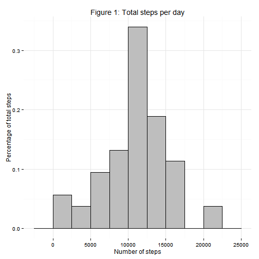
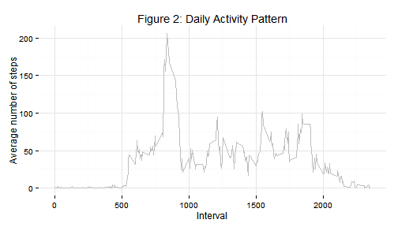
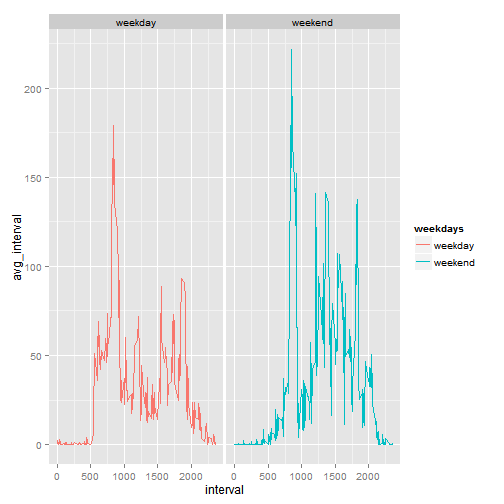

It is now possible to collect a large amount of data about personal movement using activity monitoring devices such as a Fitbit, Nike Fuelband, or Jawbone Up. These type of devices are part of the "quantified self" movement - a group of enthusiasts who take measurements about themselves regularly to improve their health, to find patterns in their behavior, or because they are tech geeks. But these data remain under-utilized both because the raw data are hard to obtain and there is a lack of statistical methods and software for processing and interpreting the data.

This assignment makes use of data from a personal activity monitoring device. This device collects data at 5 minute intervals through out the day. The data consists of two months of data from an anonymous individual collected during the months of October and November, 2012 and include the number of steps taken in 5 minute intervals each day.

###1. Downloading Data

First of all we will download the data to our computer, unzip it and load it to R. 

```r
rm(list=ls())
setwd("C:/Users/Equipo/Documents/Reproducible Research")
download.file("https://d396qusza40orc.cloudfront.net/repdata%2Fdata%2Factivity.zip"
,destfile="activity.zip",method="curl")
unzip("activity.zip")
data<-read.csv("activity.csv")
library(knitr)
str(data)
```

```
## 'data.frame':	17568 obs. of  3 variables:
##  $ steps   : int  NA NA NA NA NA NA NA NA NA NA ...
##  $ date    : Factor w/ 61 levels "2012-10-01","2012-10-02",..: 1 1 1 1 1 1 1 1 1 1 ...
##  $ interval: int  0 5 10 15 20 25 30 35 40 45 ...
```
As we can see, the dataframe has three variables: **steps** and **interval**, which are numeric vectors, and **date**, which is a factor variable with 61 levels. 

###2. Total Number of Steps Taken per Day

In this section, we processed the raw data in to ignore the NA´s in the variable **steps** and we grouped the data into days, in order to calculat the total numbers of steps taken each day and create a histogram.


```r
library(dplyr)

#Ignoring the NA´s:
data_noNA<-filter(data,! is.na(steps))

#Calculate the Total number of steps for each day:
data_date<-group_by(data_noNA,date)
steps_day<-summarise(data_date,Total_Steps=sum(steps))
kable(head(steps_day,10),caption="Total steps per day")
```


|date       | Total_Steps|
|:----------|-----------:|
|2012-10-02 |         126|
|2012-10-03 |       11352|
|2012-10-04 |       12116|
|2012-10-05 |       13294|
|2012-10-06 |       15420|
|2012-10-07 |       11015|
|2012-10-09 |       12811|
|2012-10-10 |        9900|
|2012-10-11 |       10304|
|2012-10-12 |       17382|
  
In the above table, we can see the first 10 rows of the new dataframe.


```r
#Creating the histogram:
library(ggplot2)
H<-ggplot(steps_day,aes(x=Total_Steps))
H<-H + geom_histogram(aes(y = (..count..)/sum(..count..)),
      fill="gray", color="black",binwidth=2500)
H<-H+labs(title="Figure 1: Total steps per day",x="Number of steps",
      y="Percentage of total steps")+theme_minimal()
H;
```

 

```r
Figure.1<-H
```


```r
#Calculating mean and median:
kable(summarise(steps_day,mean=mean(Total_Steps),median=median(Total_Steps)))
```


|     mean| median|
|--------:|------:|
| 10766.19|  10765|

The above table shows the mean and median of the total steps taken each day.

###3. Daily Activity Pattern

In this section, we grouped the data into 5-minute intervals and calculated average number of steps for each interval. 


```r
#Average steps by intervals:
data_interval<-group_by(data_noNA,interval)
steps_interval<-summarise(data_interval, avg_interval=mean(steps))

#Create the time series plot:
I<-ggplot(steps_interval,aes(x=interval,y=avg_interval))+
      geom_line(fill="gray",color="gray")+theme_minimal()+
      labs(title="Figure 2: Daily Activity Pattern",x="Interval",
      y="Average number of steps"); I
```

 

```r
Figure.2<-I

#Find interval with maximum on average number of steps:
A<-select(slice(arrange(steps_interval,desc(avg_interval)),1),interval)
```

Figure 2 shows a time series plot of the 5-minute interval and the average number of steps taken, averaged across all days. The 835 interval is the one thas has on average the maximum number of steps per day.

#4. Imputing Missing Values


```r
#Calculating number missing values:
MV<-sum(is.na(data$steps))
PMV<-round(sum(is.na(data$steps))/(length(data$steps))*100,0)

#Fill all missing values:
tables_merged=merge(data,steps_interval,by.x="interval",by.y="interval")
tables_merged$steps[is.na(tables_merged$steps)]<-tables_merged$avg_interval;
```
The variable *steps* has 2304 NA values, 13% of all data. The strategy to impute the missing values was to replace them with the average steps for that specific time interval. The first 10 results are shown on the following table.


```r
#Imputing NA table:
new_data<-transmute(tables_merged,steps=steps,date=date,interval=interval)
new_data<-arrange(new_data,date,interval)
kable(head(new_data,10),digits=2, caption="Imputing NA values")
```


| steps|date       | interval|
|-----:|:----------|--------:|
|  1.72|2012-10-01 |        0|
|  1.72|2012-10-01 |        5|
|  1.72|2012-10-01 |       10|
|  1.72|2012-10-01 |       15|
|  1.72|2012-10-01 |       20|
|  1.72|2012-10-01 |       25|
|  1.72|2012-10-01 |       30|
|  0.34|2012-10-01 |       35|
|  0.34|2012-10-01 |       40|
|  0.34|2012-10-01 |       45|


```r
#Calculate the Total number of steps for each day:
data_date<-group_by(new_data,date)
steps_day<-summarise(data_date,Total_Steps=sum(steps))

#Creating the histogram:

H<-ggplot(steps_day,aes(x=Total_Steps))
H<-H + geom_histogram(aes(y = (..count..)/sum(..count..)),
      fill="gray", color="black",binwidth=2500)
H<-H+labs(title="Figure 3: Total steps per day with new data",
      x="Number of steps", y="Percentage of total steps")+theme_minimal()
H
```

 

```r
Figure.3<-H
#Calculating mean and median:
kable(summarise(steps_day,mean=mean(Total_Steps),median=median(Total_Steps)),
      caption="Mean and median with new data")
```


|     mean| median|
|--------:|------:|
| 9371.437|  10395|

###5. Differences in Activity pattern between Weekdays and Weekends

To create a panel plot that shows the averaged steps for each 5-minute interval for weekdays and weekends, we first had to create a new factor variable with two leves: *weekday* and *weekend* and then group the data by intervals and also by the levels of the factor variable **weekdays**.


```r
#Create a new factor variable in the dataset with two levels - "weekday" 
#and "weekend" indicating whether a given date is a weekday or weekend day:
library(lubridate)
new_data<-transmute(new_data, steps,date=as.Date(date),interval,
weekdays=factor(wday(date),labels=
c("weekday","weekday","weekday","weekday","weekday","weekend","weekend")))
new_data$weekdays<-factor(new_data$weekdays)

#Make a panel plot containing a time series plot (i.e. type = "l") of the 
#5-minute interval (x-axis) and the average number of steps taken, averaged 
#across all weekday days or weekend days (y-axis). 
weekdays_data_interval<-group_by(new_data,interval,weekdays)
weekdays_steps_interval<-summarise(weekdays_data_interval,
avg_interval=mean(steps))

#creating the plot.
qplot(interval,avg_interval,data=weekdays_steps_interval,geom="path",facets=.~weekdays,colour=weekdays)
```

 


      
      
